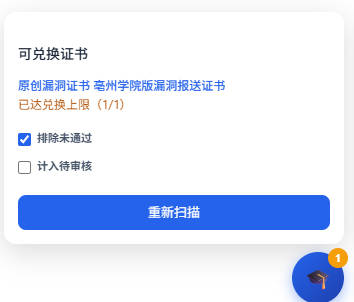

# EDUSRC 证书兑换助手

登录 [EDUSRC](https://src.sjtu.edu.cn) 后，自动匹配你可兑换的漏洞证书。

## 界面预览



右下角 🎓 悬浮窗展示可兑换证书列表，支持「排除未通过」「计入待审核」筛选，并显示各证书的兑换进度（如已达兑换上限 1/1）。

## 特点

- 使用浏览器当前登录态，数据按用户隔离
- 全站悬浮窗（右下角 🎓），扩展弹窗也可扫描
- 自动翻页抓取漏洞与证书规则
- 不检查金币，只匹配漏洞条件 + 库存

## 安装

1. 打开 `chrome://extensions/`
2. 开启「开发者模式」
3. 加载已解压的扩展程序 → 选择 `edusrc-cert-helper`

## 使用

1. 登录 https://src.sjtu.edu.cn
2. 任意 EDUSRC 页面点 🎓，或点扩展图标 → **扫描可兑换证书**

## 认可的状态

待审核、未通过 **不算**；以下状态 **算已通过**：

等待修复、已修复、已确认、已通过、已审核、修复中、已完成

## 文件结构

```
edusrc-cert-helper/
├── manifest.json
├── background.js       # 缓存、跨标签扫描调度
├── content/
│   ├── engine.js       # 解析 + 匹配 + 抓取（核心）
│   ├── bridge.js       # 页面消息桥
│   ├── badge.js        # 悬浮窗 UI
│   └── badge.css
└── popup/              # 扩展弹窗
```
